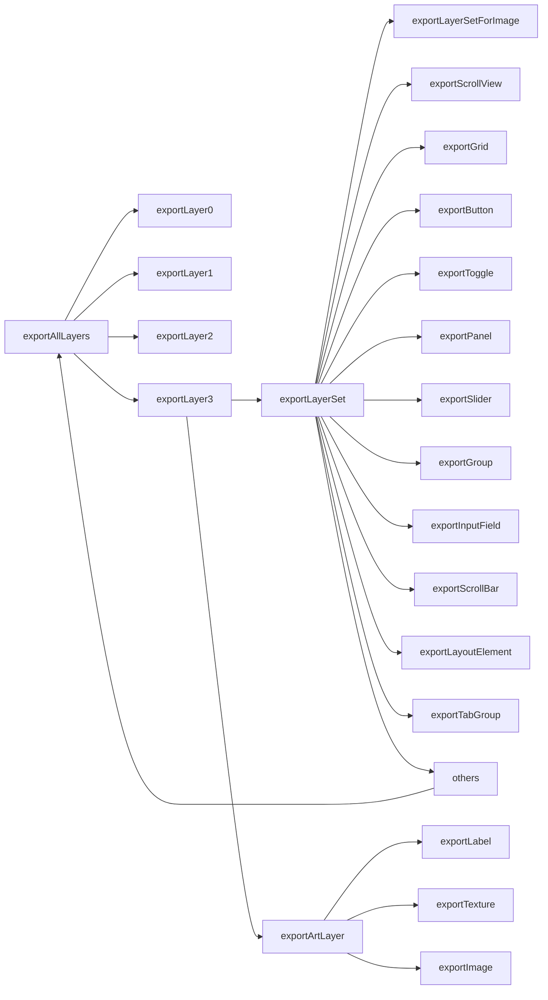

# psd2uguiv2

#### 介绍
psd export unity ugui (psd 导出 unity ugui)    
基于 https://github.com/zs9024/quick_psd2ugui 二次开发

- 本文主要讲述Photoshop如何快速生成Unity的UGUI预设
- - 支持UGUI的Unity版本都可以
- - 本人使用ps版本为AdobePhotoshopCC2017（Adobe Photoshop 版本: 2017.0.0 20161012.r.53 2016/10/12:23:00:00 CL 1094006  x64）

* [ ] 如果你是一名UI程序员，要生成UI预设，你只需要了解[PSD导出篇](#PSD导出篇)和[导入Unity篇](#导入Unity篇)
* [ ] 如果你是一名Photoshop美术，不想在Unity方面继续深造，只需要了解[命名篇](#命名篇)
* [ ] 适配项目具体情况需要了解[PSD导出篇](#PSD导出篇)、[导入Unity篇](#导入Unity篇)、[命名篇](#命名篇)、[手册篇](#手册篇)。有兴趣学习，看不懂可以联系作者(chasing2moro@qq.com)

[TOC]

# PSD导出篇
1. 将脚本文件 `Assets\PSDTool\Custom\JSCode\ExportPSDUI.jsx` 和 `Assets\PSDTool\Custom\JSCode\GetLayerStyle.js` 拷贝至“ps安装目录\Presets\Scripts”目录下，如：“E:\Program Files\PS\Adobe Photoshop CS6 (64 Bit)\Presets\Scripts”。注意先更新git，如果脚本有修改，需要用最新的覆盖。
2. 打开一个psd文件，在ps中选择“文件->脚本->ExportPSDUI”，会弹框选择一个目录（目录名要求为UI名字，如：DiamondShopCapRebateView），存放切图和配置文件即可。
3. 如果ps里面运行脚本时报错：javascript 代码丢失，或者运行时ps崩溃，解决方法：将Export PSDUI.jsx文件改成**带签名**utf8格式编码（不是无BOM）。改文件编码方法：用记事本打开文件，文件--另存为，编码选择utf-8
> 如果还是有不明原因的报错。下载编辑器adobe extendscript toolkit，一般都在C盘，如C:\Program Files (x86)\Adobe\Adobe Utilities - CS6\ExtendScript Toolkit CS6， file/open打开文件“ps安装目录\Presets\Scripts\Export PSDUI.jsx”，目标应用选择“Adobe Photoshop CS6”，就可以断点调试运行了
```
ExportPSDUI.jsx 主要功能：切图、解析命名
GetLayerStyle.js 主要功能：字体描边、阴影。https://github.com/tonton-pixel/json-photoshop-scripting/tree/master/Utility-Scripts/Get-Layer-Style
```

---

# 导入Unity篇
1. 在Unity建一个UI目录如：DiamondShopCapRebateView
2. PSD导出篇<u>第2步</u>生成的切图和配置拷贝到UI目录中（如果PSD导出篇<u>第2步</u>导出的目录已经满足要求，跳过开头两步）
3. 在菜单栏选择QuickTool/PSDImport...执行，弹框选择上一步导出的xml文件，将在hierarchy中生成ugui面板
4. PSDDispatchWindow会自动弹出。如果有旧图片，需要自己决定是否覆盖：√上就是覆盖。然后按Dispatch按钮，新图片会自动生成到对应的目录，✓上的旧图片会自动覆盖对应路径的图片，没✓上的旧图片会引用对应路径的图片**不做覆盖处理**。(如果看不懂什么意思，请联系作者)

[插图](https://github.com/chasing2moro/psd2uguiv2/blob/main/Game/PSD/imageName3.jpg)
5. 如果觉得生成的UI没问题，不需要再重新生成，可以按如下按钮Delete All PSD Resource删除第一步目录下所有文件。
[插图](https://github.com/chasing2moro/psd2uguiv2/blob/main/Game/PSD/imageName4.jpg)

---
# 命名篇
## 1.图片命名
- 格式：DirName1+DirName2+`ImageName`!ControlName
- +为路径/的替代符
- !的左边是图片路径，!的右边是控件名字
- Sprites/会自动插入到`ImageName`前面（这是我们项目特点，图片都需要放在Sprites下）
- 统一父目录为 Assets\CustomAssets\Arts_Dependencies

例子：`UIAtlas+CommonSprite+slg_fallout_activity_tab!tabImage`,存放的路径是Assets/CustomAssets/Arts_Dependencies/`UIAtlas`/`CommonSprite`/Sprites/`slg_fallout_activity_tab`.png，控件的名字是`tabImage`。

[插图](https://github.com/chasing2moro/psd2uguiv2/blob/main/Game/PSD/imageName.jpg)

### 1.1UIAtlas可以省略
注意：因为UIAtlas出现的频率太多，UIAtlas可以省略不写
比如：`CommonSprite+slg_fallout_activity_tab!tabImage`,存放的路径是Assets/CustomAssets/Arts_Dependencies/UIAtlas/`CommonSprite`/Sprites/`slg_fallout_activity_tab`.png，控件的名字是`tabImage`。

[插图](https://github.com/chasing2moro/psd2uguiv2/blob/main/Game/PSD/imageName2.png)

### 1.2当前界面图片，可以只写图片名
 注意：如果图片属于当前界面，不会跟其他界面复用，可以只写图片名。
比如：`slg_fallout_activity_tab!tabImage`,存放的路径是Assets/CustomAssets/Arts_Dependencies/UIAtlas/*View/Sprites/`slg_fallout_activity_tab`.png，控件的名字是`tabImage`。

[插图](https://github.com/chasing2moro/psd2uguiv2/blob/main/Game/PSD/imageName1.jpg)

### 1.3九宫格切图命名
结尾_9S:XX（四个边界宽度一样）或结尾_9S:XX:XX:XX:XX（左:上:右:下）的图会切成九宫格的图片。比如_9S:20会把图层切成左右上下都为20像素的九宫格图片。_9S:15:10:15:15会把图层切成左15，上10，右15，下15的九宫格图

### 1.4Spine动画命名
控件名一定要包含Spine，否则会显示图片。Spine动画需要程序自己挂上去，不能显示图片

## 2.Button命名 
@Button结尾
text命名随意
图片命名随意
额外多出的图片需要放在Background目录下，因为按钮按下只有一张图片变色，所以根目录下只能有一张图片。

[插图](https://github.com/chasing2moro/psd2uguiv2/blob/main/Game/PSD/button.jpg)

## 3.ScrollView命名
@ScrollView ：标识一块滑动区域
如下结尾的含义：
:H ：滑动方向为水平滑动
:GH : 对上面的扩展、可变行列
:V ：滑动方向为垂直滑动
:GV ：对上面的扩展、可变行列
@Size： 标识滑动区域的大小，可以随便用一张图，但是要保证这张图的尺寸完全覆盖滑动的区域，这张图不会切出来，且要放在ScrollView 组的最后面

[插图](https://github.com/chasing2moro/psd2uguiv2/blob/main/Game/PSD/scrollview.jpg)
### 3.1ScrollView-Item命名
@LE结尾 ：自动布局元素，对应UGUI的LayoutElement。加该关键字后，滑动列表的子项(item)会自动布局。Item前面加~是告诉解析器，我只当做显示，不导出。但至少2个Item，来告诉Unity相邻2个Item的距离。

## 4.Slider命名
@Slider：滑动条组件，可用作进度条，血条，音量调节条等。
:L ：标识滑动方向从左到右
:R ：标识滑动方向从右到左
:T ：标识滑动方向从上到下
:B ：标识滑动方向从下到上
@Size： 标识滑动区域的大小，可以随便用一张图，但是要保证这张图的尺寸完全覆盖滑动的区域，这张图不会切出来，且要放在Slider组的最后面
_Bg ：滑动条背景图，可以用九宫格
_Fill ：滑动条前景图，可以用九宫格
_Handle ：滑动条的滑块，看情况添加，可以没有

[插图](https://github.com/chasing2moro/psd2uguiv2/blob/main/Game/PSD/slider.jpg)

## 5.Toggle命名
@Toggle：标识开关或选择框，对应ugui的Toggle组件
_Background：选择框的背景图
_Checkmark：选择框的选中状态图

[插图](https://github.com/chasing2moro/psd2uguiv2/blob/main/Game/PSD/toggle.png)

## 6.TabGroup命名
@TabGroup：页签组件（自定义），可方便地切换页签，点击时自动隐藏显示所控制的页面。该组件继承了ugui的ToggleGroup（TabGroup类）和Toggle（Tab类），TabGroup控制各个Tab的切换，Tab控制Page的隐藏显示。
_Tab：标识Tab组件，冒号“:”后面是该tab的标志符，会在生成prefab时赋值给tab的tag字段，该值在各个tab中不能相同（因为页签切换的时候总是只会显示一个）
_Page：标识tab所控制的页面，页签中的具体内容都应放在这个图层组下面
_TabSel：标识tab选中时的背景图
_TabUnSel：标识tab未选中时的背景图

[插图](https://github.com/chasing2moro/psd2uguiv2/blob/main/Game/PSD/tab.jpg)

## 7.InputField命名
@InputField：输入组件
包含holder: 提示玩家输入的文字
包含text: 玩家输入后的文字。所以上面的holder命名千万不要包含text（觉得有问题，我可能改）
background: 输入背景框

[插图](https://github.com/chasing2moro/psd2uguiv2/blob/main/Game/PSD/inputfield.jpg)

## 8.Text命名
### 8.1目前为止 阴影投射方向只支持右下
### 8.2不支持旋转字体
因为旋转字体后，

[插图](https://github.com/chasing2moro/psd2uguiv2/blob/main/Game/PSD/rotate.png)
一旦保存psd

[插图](https://github.com/chasing2moro/psd2uguiv2/blob/main/Game/PSD/rotatesave.png)
它的角度信息就丢失了。（如果需要旋转，可以扩展，命名后加参数）


## 9.节点命名
如果节点命名为ContentRoot，会自动添加一个自适应脚本（一般是一个UI的根节点会这样命名）

[插图](https://github.com/chasing2moro/psd2uguiv2/blob/main/Game/PSD/contentroot.jpg)

---
# 手册篇
## 1.分辨率 1334x750
最新的UI，美术会按照 分辨率 1334x750 制作。

## 2.js编程指导
链接：https://pan.baidu.com/s/10RXP3E-7ejYBOS19za1IaQ?pwd=1234 
提取码：1234
`
### 2.1JS代码主要流程

## 3.js编程api文档
链接：https://pan.baidu.com/s/1IPk4L2v1k1imWQMvwSCfJw?pwd=1234 
提取码：1234

## 4.插件路径
### 4.1 Assets/PSD2UGUI 
主要代码、例子资源、一部分本项目定制代码
### 4.2 Assets/PSDTool 
大部分本项目定制代码（包括Unity的C#、Photoshop的JS）、Plugins
### 4.3 Assets/QuickCode 
控件引用绑定，本项目暂未使用

## 5.原插件来源
github路径：https://github.com/zs9024/quick_psd2ugui
为什么选这个插件？作者已经明显表面：不支持字体描边、阴影，需要自行扩展。

[插图](https://github.com/chasing2moro/psd2uguiv2/blob/main/Game/PSD/outlineshadow.jpg)
其实，我找了几个插件都不支持描边、阴影。看了好多插件，都没满足我们项目要求的。于是我选了上面这个Unity的C#代码最简洁、Photoshop的JS代码开源 的插件[quick_psd2ugui](https://github.com/zs9024/quick_psd2ugui) 。
有些插件（比如：[Psd 2 Unity uGUI Pro](https://assetstore.unity.com/packages/tools/gui/psd-2-ugui-pro-16131)）很恶心： JS 代码竟然加密了。即使可以解密JS代码，但是没法直接运行，很多代码多了空格、换行，无法短时间内修正。当然，无一例外，[Psd 2 Unity uGUI Pro](https://assetstore.unity.com/packages/tools/gui/psd-2-ugui-pro-16131)文字也不支持描边、阴影。我们也引入了大量代码，修改插件才支持字体描边、阴影。

# 例子
例子根目录：Assets\PSD2UGUI\SampleSLG
## 1134x750.psd
### Button、TabGroup、Toggle、Slider、Progress(不可手动修改Value值的Slider)、Spine动画、ScrollView(多行列)
## ScrollView.psd
### ScrollView(单行列)
